# Mejiro31 の使い方 ([スタートページに戻る](../README.md))

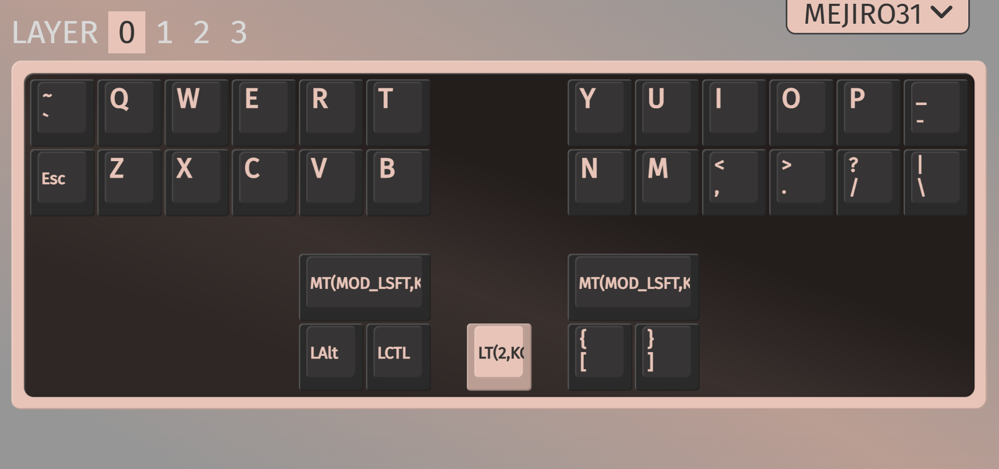

## 目次
  1. [キーレイアウト](#キーレイアウト)
     - [QWERTY レイヤー](#qwerty-レイヤー)
     - [GEMINI レイヤー](#gemini-レイヤー)
     - [NUMBER レイヤー](#number-レイヤー)
     - [FUNCTION レイヤー](#function-レイヤー)
  2. [キーの入れ替え方法](#キーの入れ替え方法) 
  3. [高度なカスタム](#高度なカスタム)
  4. [お問い合わせ](#お問い合わせ)

## キーレイアウト

デフォルトではこのようなキー配置になっています。

### QWERTY レイヤー

QWERTY レイヤーは標準のレイヤーです。

Mejiro31 を接続したときは毎回このレイヤーでスタートします。

[二段圧縮](https://note.com/jeebis_keyboard/n/ncbc327906050)を使用しており、キーの $1/3$ は同指の隣接キーの同時押しで入力します。


もし QWERTY ではなく、Dvorakや大西配列のような代替レイアウトを使用したい場合は[高度なカスタム](#高度なカスタム)の章をご覧ください。

また、左右のスペースバーはそれぞれ Space と Enter ですが、長押しで Shift キーとして動作します。

真ん中のレイヤーキーを短く押すと GEMINI レイヤーに切り替わり、長押しで NUMBER レイヤーに切り替わります。

### GEMINI レイヤー
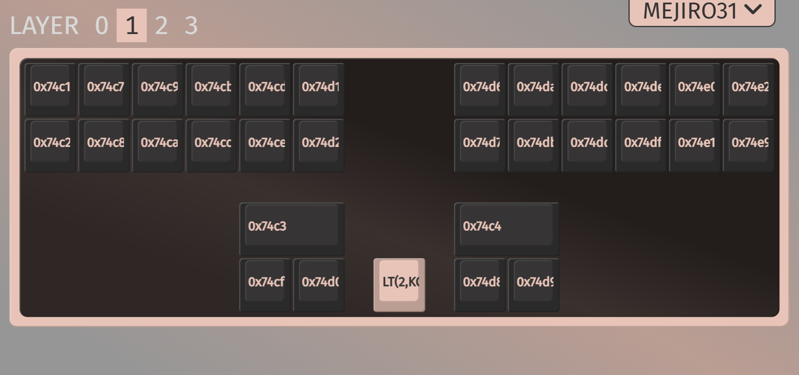
GEMINI レイヤーはメジロ式を使うために必要なレイヤーです。

メジロ式を動かす Plover というソフト専用の出力が割り当たっています。

なので、基本的にこのキー配置を変更することはありません。

急にキーボードが入力できなくなったときは GEMINI レイヤーになってしまっていないかご確認ください。

真ん中のレイヤーキーを短く押すと QWERTY レイヤーに切り替わり、長押しで NUMBER レイヤーに切り替わります。

### NUMBER レイヤー
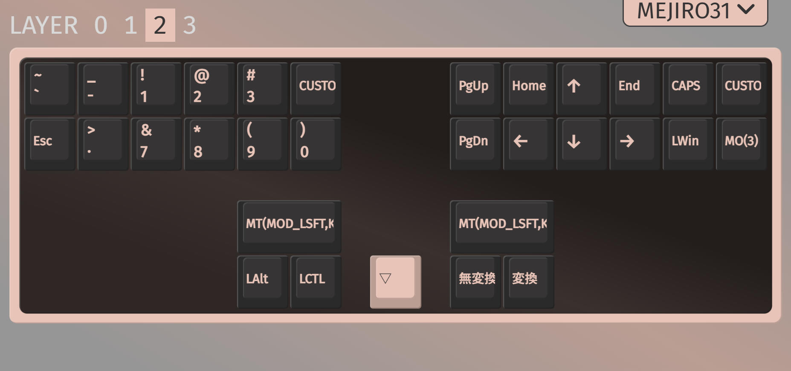
NUMBER レイヤーには数字キーや矢印キー、 Windows キー、その他機能キーが割り当たっています。

0 の上のキーは 00 キーで、二つの 0 を出力します。

一番右の、上段のキーは代替レイアウトの有効・無効を切りかえるキーで、下段のキーは長押しで FUNCTION レイヤーに遷移するキーです。

ただし、デフォルトの設定では代替レイアウトキーは無効になっています。それは代替レイアウトが定義されていないからです。代替レイアウトを有効化したい場合は[高度なカスタム](#高度なカスタム)の章をご覧ください。

### FUNCTION レイヤー
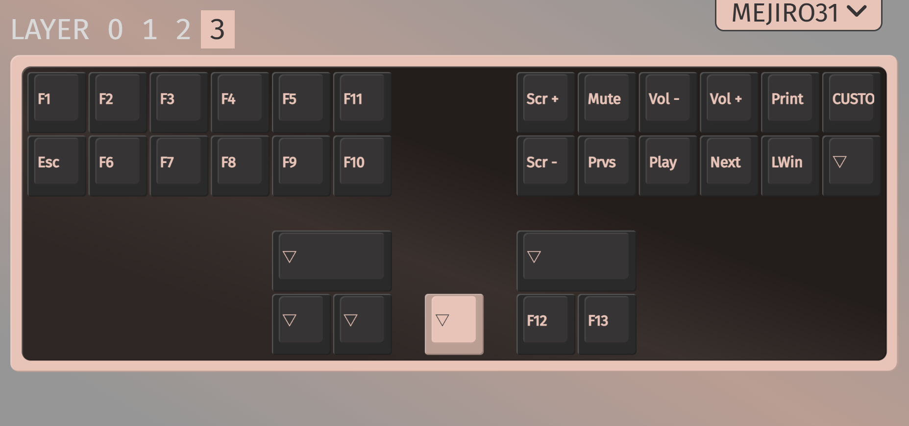
FUNCTION レイヤーには F1 ~ F13 キーやメディアキーが割り当たっています。

一番右の、上段のキーは PC のキーボード設定が JIS でも US キーボードとして入力できるモードの切り替えキーです。

Mejiro31 は US キーボードとして出力するので、 PC が JIS レイアウトの時はこのモードをオンにしないと設定どおりの出力になりません。

ただし、PC 側のショートカットキーは JIS のままなのでお気を付けください。

## キーの入れ替え方法

まずはこちらのファイルをダウンロードします。
- [via_keymap.json](https://github.com/JEEBIS27/Mejiro31/releases/download/v0.0.0/via_keymap.json)

次に、お好きなブラウザーから`VIA`にアクセスして、 DESIGN を選びます。

(以下のリンクからアクセスすると自動で DESIGN の画面に遷移します。)

- [VIA/DESIGN](https://www.usevia.app/design)

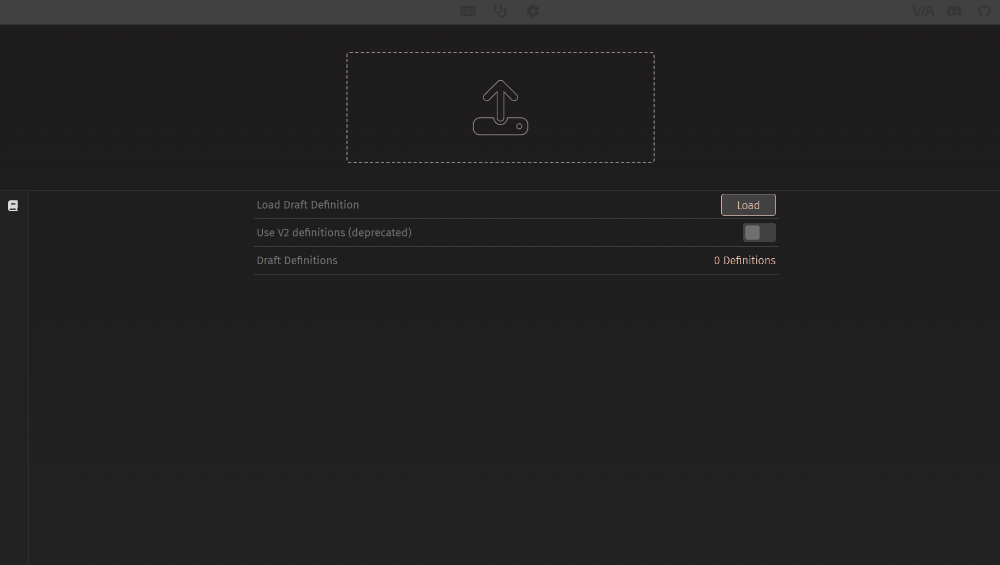

DESIGN タブを開いたら`Load`ボタンを押します。


ここで先ほどダウンロードした JSON ファイルを選択し、正常に読み込まれると以下の画像のようにレイアウトが表示されます。

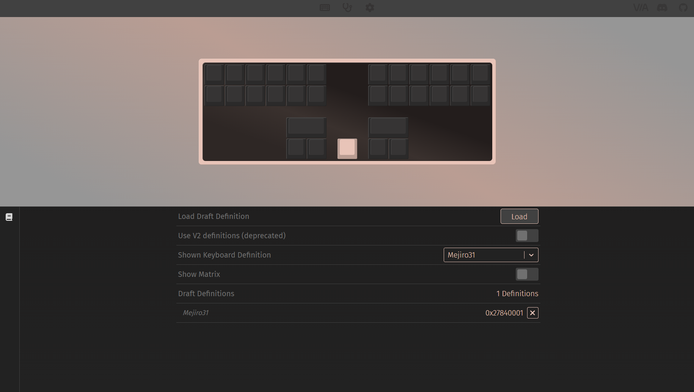

JSON ファイルの読み込みが完了後、 CONFIGURE タブに移動します。

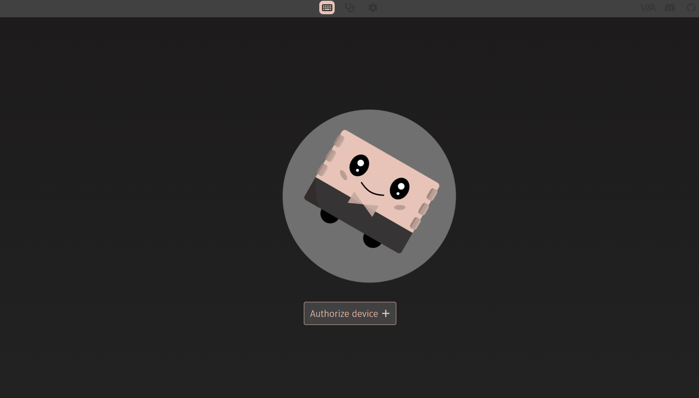

CONFIGURE タブの`Authorize device`ボタンを押し、ポップアップ画面で Mejiro31 を選択して接続します。

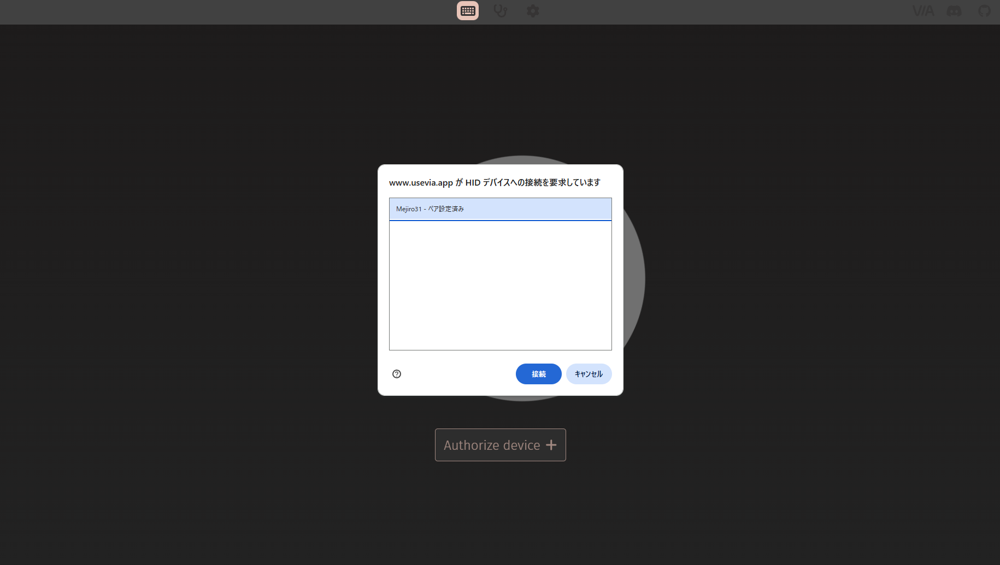

するとキーマップ編集画面に遷移するので、キーボードのキーをクリックし変更したいキーを下から選んでクリックすることでキーを入れ替えることができます。

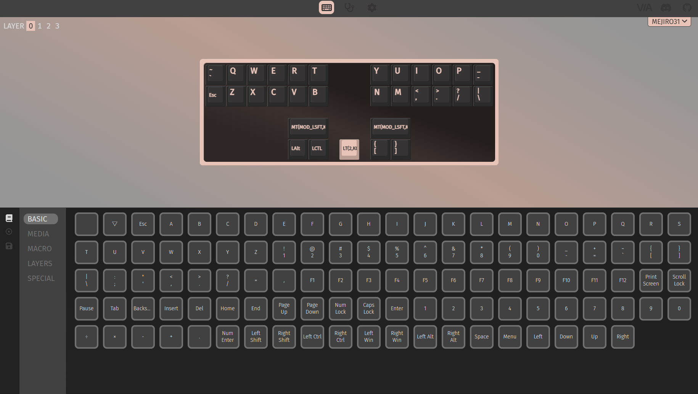

一度ここまでくれば、今後は VIA の CONFIGURE タブを開いて Mejiro31 を接続するだけでキーマップの変更が可能です。つまり、 JSON ファイルの読み込みは一度だけで大丈夫です。

(VIA からだと上下キーの同時押しの再定義ができません。なので事実上変えることができるのは NUMBER レイヤーや FUNCTION レイヤーのキーだけです。もし Dvorak や大西配列のような代替レイアウトを使用したい場合は[高度なカスタム](#高度なカスタム)の章をご覧ください。)

## 高度なカスタム

### 目次
  1. [高度なカスタムを行う方法](#高度なカスタムを行う方法)
     - [ファームウェアリポジトリをフォークする](#ファームウェアリポジトリをフォークする)
     - [ファームウェアのビルド環境構築方法](#ファームウェアのビルド環境構築方法)
  2. [高度なカスタムの紹介](#高度なカスタムの紹介)
     - [レイヤーごとの言語設定](#レイヤーごとの言語設定)
     - [代替レイアウトの有効化](#代替レイアウトの有効化)
     - [コンボの詳細設定](#コンボの詳細設定)
     - [config.h の設定](#config.h-の設定) 

Mejiro31 は高度なカスタムとして、 QMK ファームウェアの設定を変更することでより細かい需要にこたえることができます。

### 高度なカスタムを行う方法

高度なカスタムを行うためには Mejiro31 のファームウェアリポジトリをあなたのアカウントでフォークし、ビルド環境を構築していただく必要があります。

そうやって書き換えたソースコードをビルドし、生成されたファームウェアを Mejiro31 に書き込むことで高度なカスタムが可能になります。

### ファームウェアリポジトリをフォークする

[github.com](https://github.com/) にアクセスします。


github アカウントを持っていない場合はここでサインアップして新しく作成してください。

アカウントを作成したら、以下のリンクから Mejiro31 の QMK ファームウェアリポジトリにアクセスします。
- [JEEBIS27/qmk_firmware](https://github.com/JEEBIS27/qmk_firmware)

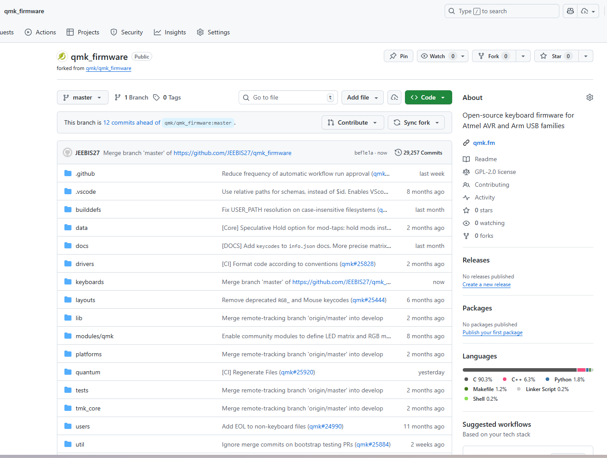

右上の`Fork`ボタンを押して、あなたのアカウントにリポジトリをフォークします。

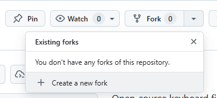

`Fork`ボタンを押すと次のような画面になります。`Create fork`ボタンを押してフォークを完了させましょう。

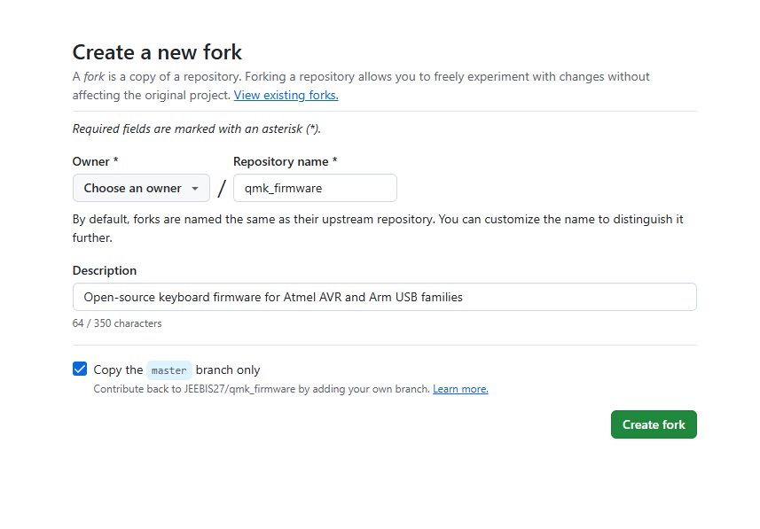

フォークが完了すると、あなたのアカウントの下に Mejiro31 の QMK ファームウェアリポジトリが作成されます。

フォークしたあなたのリポジトリにアクセスし、緑色の`Code`ボタンを押して URL をコピーします。

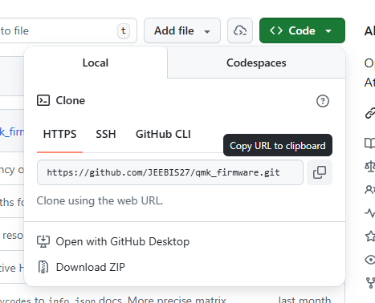

次の[ファームウェアのビルド環境構築方法](#ファームウェアのビルド環境構築方法)の章でこの URL を使用します。

### ファームウェアのビルド環境構築方法

PC 環境によってやり方が異なるのでここでは詳しく紹介しませんが、以下の説明が参考になると思います。

- [QMKファームウェアビルド構築手順(Windows QMK MSYS編)](https://gist.github.com/e3w2q/4bc86e531d1c893d3d13af3e9895a94a)
- [MacでのQMKファームウェアビルド構築方法の参考記事](https://qiita.com/Nikk0r0/items/4089c194715185a124a5)

説明の中で`git clone <repository_url>`というようなコマンドが出てきたら、先ほどコピーしたあなたのフォークしたリポジトリの URL を使用するようにしてください。

### 高度なカスタムの紹介

ファームウェアのソースコードを編集することで、高度なカスタムが可能です。

#### レイヤーごとの言語設定

レイヤーが切り替わるごとに、設定した言語に対応して IME を自動で切り替えることができます。

この機能によって、真ん中のレイヤーキーをキーボード・ステノモードの切り替えキーかつ IME 切り替えキーとして使用することができます。

例えば、日本語入力はメジロ式、英語入力は普通のキーボード入力で行うという場合、 QWERTY レイヤーで IME OFF 、 GEMINI レイヤーでは IME ON に自動で切り替えるようにすることができます。

(※ Windows11 環境では IME のオンオフキーがデフォルトでは動作しないため、この機能を使用する場合は以下の設定を行う必要があります。

まず設定アプリを開き、`時刻と言語` > `言語と地域` > `オプション` > `Microsoft IME` > `キーのタッチとカスタマイズ` に移動します。

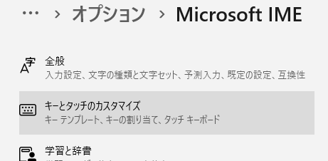

ここの`キーの割り当て`で変換キーと無変換キーの割り当てをそれぞれ`IME オン`と`IME オフ`に変更します。

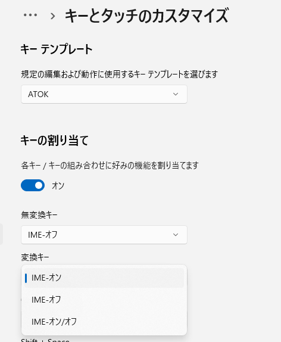

※ MacOS 環境ではデフォルトで IME のオンオフキーが動作するため、特に設定を行う必要はありません。)

Mejiro31 の言語設定をするにはまず、あなたがフォークしたリポジトリの`keyboards/jeebis/mejiro31/keymaps/jp_qwerty/keymap.c`を開きます。

すると51 行目あたりに以下のコードがあります。

```
<keymaps/jp_qwerty/keymap.c>
// 0:未使用, 1:英語, 2:日本語, 3:無変更
static int stn_lang = 2; // ステノ時の言語
static int kbd_lang = 1; // キーボード時の言語
```

ここでは、`stn_lang`が GEMINI レイヤー (ステノモード) の言語設定、`kbd_lang`が QWERTY レイヤー (キーボードモード) の言語設定を表しています。

それぞれの変数に以下の数値を設定することで言語設定を変更できます。

| 数値 | 言語設定 |
| ---- | ------- |
| 1    | 英語    |
| 2    | 日本語  |
| その他 | 無変更 |

デフォルトでは、ステノモードはメジロ式で日本語入力、キーボードモードでは英語入力を QWERTY で行うように設定されています。

逆に、キーボードで日本語入力、英語速記で英語入力を行いたい場合は以下のように設定します。

```
<keymaps/jp_qwerty/keymap.c>
static int stn_lang = 1; // ステノ時の言語
static int kbd_lang = 2; // キーボード時の言語
```

#### 代替レイアウトの有効化

デフォルトでは QWERTY レイヤーのみが定義されていますが、 Dvorak や大西配列のような代替レイアウトを何でも好きに使うことができます。

ただし、モディファイアキーを押している間は代替レイアウトは無効になり、 QWERTY として動作します。

ここでは大西配列の設定を例として紹介します。

まずは、`keyboards/jeebis/mejiro31/keymaps/jp_o24/keymap.c`を開きます。

54 行目あたりに以下のコードがあります。
```
<keymaps/jp_o24/keymap.c>
static int alt_lang = 3; // Alternative Layoutの言語設定
```

ここの`alt_lang`変数はデフォルトでは 3 (日英両方) に設定されています。

これを以下の数値に変更することで代替レイアウトの言語を設定できます。

| 数値 | 言語設定 |
| ---- | ------- |
| 1    | 英語 |
| 2    | 日本語 |
| 3    | 日英両方 |

たとえば、 Dvorak などのレイアウトを英語入力の時だけで使用したい場合は 1 に設定します。

```
<keymaps/jp_dvorak/keymap.c>
static int alt_lang = 1; // Alternative Layoutの言語設定
```

また、大西配列などのレイアウトを日本語入力の時だけで使用したい場合は 2 に設定します。

```<keymaps/jp_o24/keymap.c>
static int alt_lang = 2; // Alternative Layoutの言語設定
```

ここで言語を設定すると、NUMBER レイヤーの右親指下段にある変換・無変換キーで IME の切り替えと代替レイアウトの有効・無効を同時に切り替えることができるようになります。

`alt_lang`変数を 1 あるいは 2 を設定した場合、 IME 切替キーを有効化する必要があります。全章の[レイヤーごとの言語設定](#レイヤーごとの言語設定)をご覧ください。

次に、代替レイアウトのキーマップを定義します。

202 行目あたりに以下のコードがあります。

```
<keymaps/jp_o24/keymap.c>
// 配列：大西配列
// ┌─────┬─────┬─────┬─────┬─────┐┌─────┬─────┬─────┬─────┬─────┬─────┐
// │  q  │  l  │  u  │  ,  │  .  ││  f  │  w  │  r  │  y  │  p  │  /  │
// ├──e──┼──i──┼──a──┼──o──┼──-──┤├──k──┼──t──┼──n──┼──s──┼──h──┼──'──┤
// │  z  │  x  │  c  │  v  │  ;  ││  g  │  d  │  m  │  j  │  b  │  \  │
// └─────┴─────┴─────┴─────┴─────┘└─────┴─────┴─────┴─────┴─────┴─────┘
static const alt_mapping_t alt_mappings[] PROGMEM = {
    {KC_Q,    KC_Q,    KC_Q},
    {KC_W,    KC_L,    KC_L},
    {KC_E,    KC_U,    KC_U},
    {KC_R,    KC_COMM, KC_LABK},
    {KC_T,    KC_DOT,  KC_RABK},
    {KC_Y,    KC_F,    KC_F},
    {KC_U,    KC_W,    KC_W},
    {KC_I,    KC_R,    KC_R},
    {KC_O,    KC_Y,    KC_Y},
    {KC_P,    KC_P,    KC_P},
    {KC_MINS, KC_SLSH, KC_QUES},

    {KC_A,    KC_E,    KC_E},
    {KC_S,    KC_I,    KC_I},
    {KC_D,    KC_A,    KC_A},
    {KC_F,    KC_O,    KC_O},
    {KC_G,    KC_MINS, KC_UNDS},
    {KC_H,    KC_K,    KC_K},
    {KC_J,    KC_T,    KC_T},
    {KC_K,    KC_N,    KC_N},
    {KC_L,    KC_S,    KC_S},
    {KC_SCLN, KC_H,    KC_H},
    {KC_QUOT, KC_QUOT, KC_DQUO},

    {KC_Z,    KC_Z,    KC_Z},
    {KC_X,    KC_X,    KC_X},
    {KC_C,    KC_C,    KC_C},
    {KC_V,    KC_V,    KC_V},
    {KC_B,    KC_SCLN, KC_COLN},
    {KC_N,    KC_G,    KC_G},
    {KC_M,    KC_D,    KC_D},
    {KC_COMM, KC_M,    KC_M},
    {KC_DOT,  KC_J,    KC_J},
    {KC_SLSH, KC_B,    KC_B},
    {KC_BSLS, KC_BSLS, KC_PIPE},
};
```

ここで定義されている`alt_transform`関数が代替レイアウトのキーマップを定義しています。

ここでは大西配列が定義されていますが、ここを書き換えることで好きなレイアウトを定義することができます。

とはいえ、個々人でこれを設定するのは大変なので、いくつか代表的なレイアウトはすでに用意してあります。それを [releases](https://github.com/JEEBIS27/Mejiro31/releases/latest) からダウンロードして利用することをおすすめします。

現状（v0.2.0）では以下のレイアウトが用意されています。
- [QWERTY 配列](https://github.com/JEEBIS27/Mejiro31/releases/download/v0.2.0/jeebis_mejiro31_jp_qwerty.uf2)
- [Dvorak 配列](https://github.com/JEEBIS27/Mejiro31/releases/download/v0.2.0/jeebis_mejiro31_jp_dvorak.uf2)
- [Boo 配列](https://github.com/JEEBIS27/Mejiro31/releases/download/v0.2.0/jeebis_mejiro31_jp_boo.uf2)
- [Colemak 配列](https://github.com/JEEBIS27/Mejiro31/releases/download/v0.2.0/jeebis_mejiro31_jp_colemak.uf2)
- [Colemak-DH 配列](https://github.com/JEEBIS27/Mejiro31/releases/download/v0.2.0/jeebis_mejiro31_jp_colemak-dh.uf2)
- [Workman 配列](https://github.com/JEEBIS27/Mejiro31/releases/download/v0.2.0/jeebis_mejiro31_jp_workman.uf2)
- [Graphite 配列](https://github.com/JEEBIS27/Mejiro31/releases/download/v0.2.0/jeebis_mejiro31_jp_graphite.uf2)
- [Astarte 配列](https://github.com/JEEBIS27/Mejiro31/releases/download/v0.2.0/jeebis_mejiro31_jp_astarte.uf2)
- [Eucalyn 配列](https://github.com/JEEBIS27/Mejiro31/releases/download/v0.2.0/jeebis_mejiro31_jp_eucalyn.uf2)
- [Eucalyn 改](https://github.com/JEEBIS27/Mejiro31/releases/download/v0.2.0/jeebis_mejiro31_jp_eucalyn.uf2)
- [Tomisuke 配列](https://github.com/JEEBIS27/Mejiro31/releases/download/v0.2.0/jeebis_mejiro31_jp_tomisuke.uf2)
- [大西配列](https://github.com/JEEBIS27/Mejiro31/releases/download/v0.2.0/jeebis_mejiro31_jp_o24.uf2)
- [Merlin 配列](https://github.com/JEEBIS27/Mejiro31/releases/download/v0.2.0/jeebis_mejiro31_jp_merlin.uf2)

もし他のレイアウトを追加してほしい場合は GitHub の [Issues](https://github.com/JEEBIS27/Mejiro31/issues) からリクエストしてください。

### コンボの詳細設定

Mejiro31 では QMK 標準のコンボ機能を使用しておらず、独自実装のコンボ機能を使用しています。

そのため、コンボの定義を行うにはソースコードを書き換える必要があります。

既存のコンボを変更したり、新しいコンボを追加したりするには 373 行目あたりの以下のコードを編集します。

```
<keymaps/jp_qwerty/keymap.c>
// コンボ定義（順不同）
const combo_pair_t combo_pairs[] PROGMEM = {

    {KC_Q,    KC_Z,    KC_A,    _QWERTY},
    {KC_W,    KC_X,    KC_S,    _QWERTY},
    {KC_E,    KC_C,    KC_D,    _QWERTY},
    {KC_R,    KC_V,    KC_F,    _QWERTY},
    {KC_T,    KC_B,    KC_G,    _QWERTY},
    {KC_Y,    KC_N,    KC_H,    _QWERTY},
    {KC_U,    KC_M,    KC_J,    _QWERTY},
    {KC_I,    KC_COMM, KC_K,    _QWERTY},
    {KC_O,    KC_DOT,  KC_L,    _QWERTY},
    {KC_P,    KC_SLSH, KC_SCLN, _QWERTY},
    {KC_MINS, KC_BSLS, KC_QUOT, _QWERTY},
    {KC_LBRC, KC_RBRC, KC_EQL,  _QWERTY},
    {KC_V,    KC_B,    KC_TAB,  _QWERTY},
    {KC_R,    KC_T,    KC_ESC,  _QWERTY},
    {KC_N,    KC_M,    KC_BSPC, _QWERTY},
    {KC_Y,    KC_U,    KC_DEL,  _QWERTY},

    {KC_1,    KC_7,    KC_4,     _NUMBER},
    {KC_2,    KC_8,    KC_5,     _NUMBER},
    {KC_3,    KC_9,    KC_6,     _NUMBER},
    {KC_0,    KC_DZ,   KC_TZ,    _NUMBER},
    {KC_DOT,  KC_MINS, KC_COMMA, _NUMBER},
    {KC_9,    KC_DOT,  KC_TAB,   _NUMBER},
    {KC_3,    KC_MINS, KC_ESC,   _NUMBER},
    {KC_PGDN, KC_LEFT, KC_BSPC,  _NUMBER},
    {KC_PGUP, KC_HOME, KC_DEL,   _NUMBER},
};
```

例えば、 QWERTY レイヤーで V キーと M キーの同時押しで Enter キーを出力するコンボを追加したい場合は、以下のようなコードを追加します。

```
<keymaps/via/keymap.c>
    {KC_V,    KC_M,    KC_ENT,  _QWERTY},
```

ただし、三キー同時押し以上のコンボは現在サポートされていないためご注意ください。

また、コンボの出力キーコードをコンボの要素として使うこともできません。例えば、 QWERTY レイヤーで F キーと J キーの同時押しで F キーを出力するコンボは定義できません。

### config.h の設定

Mejiro31 のファームウェアは QMK ですので、標準で利用できる`config.h`という設定ファイルがあり、ここで様々な設定を行うことができます。

例えば、キーの長押し時間を変更したい場合は`keyboards/jeebis/mejiro31/config.h`を開き、以下のコードを編集します。

```
<config.h>
#define TAPPING_TERM 200
```

ここで設定されている数値はミリ秒単位で、キーが長押しとして認識されるまでの時間を表しています。

例えば、`TAPPING_TERM`を 300 に設定すると、 300 ms 以上押された Mod-Tap のキーは長押しとして認識されるようになります。

このような`config.h`の設定は、 QMK の公式ドキュメントをご覧ください。
- [QMK Config Options](https://docs.qmk.fm/config_options)

## お問い合わせ

お問い合わせは`jeebis.iox@gmail.com`か、特に不具合等は Mejiro31 の GitHub リポジトリの [Issues](https://github.com/JEEBIS27/Mejiro31/issues) へお願いします。

[スタートページに戻る](../README.md)
