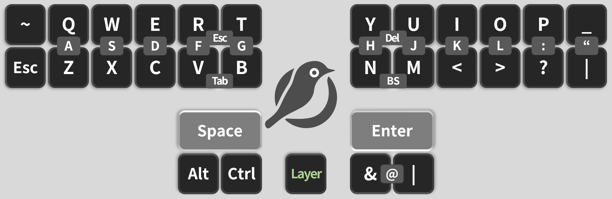
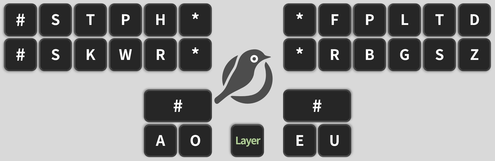
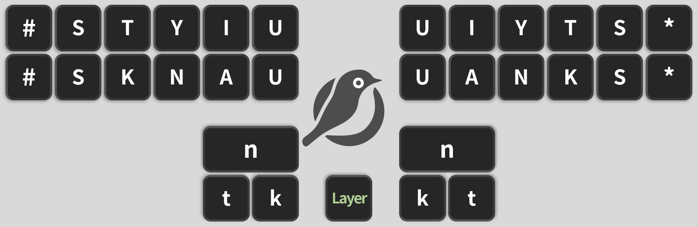
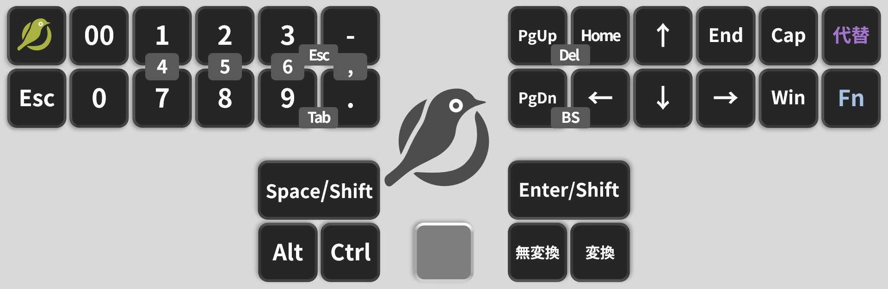
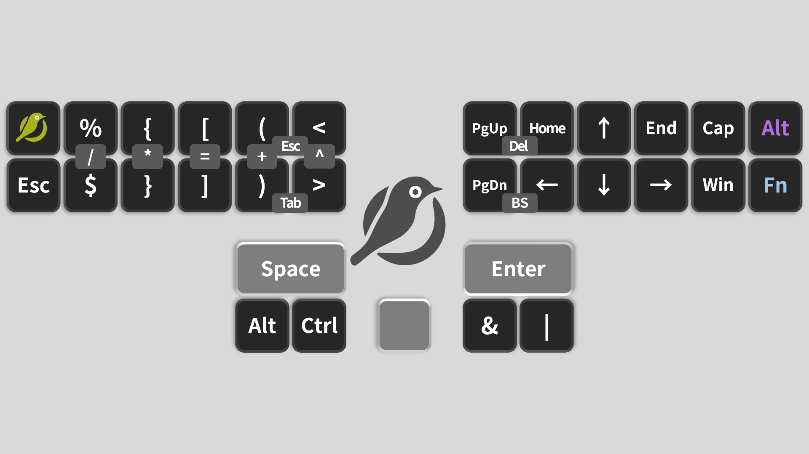
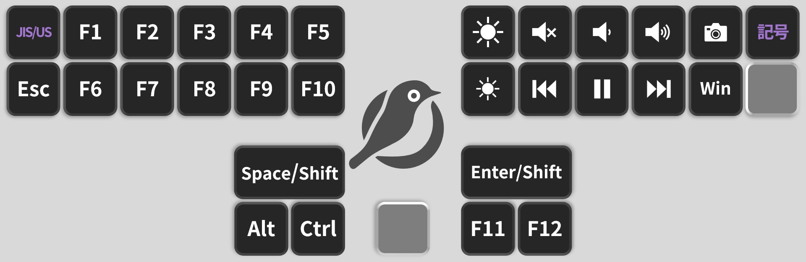

# How to Use Mejiro31 ([Back to Start Page](../README.md))


## Table of Contents
  1. [Key Layouts](#key-layouts)
     - [QWERTY Layer](#qwerty-layer)
     - [GEMINI Layer](#gemini-layer)
     - [NUMBER Layer](#number-layer)
     - [FUNCTION Layer](#function-layer)
  2. [How to Remap Keys](#how-to-remap-keys)
  3. [Advanced Customization](#advanced-customization)
  4. [Contact Us](#contact-us)

## Key Layouts

The default key layout looks like this.

### QWERTY Layer

The QWERTY layer is the standard layer.

Every time you connect Mejiro31, it starts on this layer.

It uses [two-step compression](https://note.com/jeebis_keyboard/n/ncbc327906050), so about $1/3$ of the keys are typed by pressing adjacent keys simultaneously with the same finger.


If you want an alternate layout such as Dvorak or Colemak instead of QWERTY, see [Advanced Customization](#advanced-customization).

The left and right spacebars are Space and Enter, respectively, but a long press turns them into Shift.

When Shift is held, the layout changes as shown below.



Tap the center layer key to switch to the GEMINI layer; hold it to switch to the NUMBER layer.

### GEMINI Layer

The GEMINI layer is required for using stenography systems other than Mejiro-style.

It outputs codes dedicated to Plover, the software that drives stenography.

You generally do not change this keymap.

If the keyboard suddenly stops typing, check that you have not switched to the GEMINI layer.

By default, this layer is disabled and overridden by the QMK Mejiro-style layer.



Tap the center layer key to go back to the QWERTY layer; hold it to switch to the NUMBER layer.

### NUMBER Layer

The NUMBER layer holds numbers, arrow keys, the Windows key, and other function keys.

The key above 0 is a 00 key that outputs two zeros.

When Shift is held, the layout changes as shown below.



On the far left, the top key is the QMK Mejiro-style toggle. Holding it disables Mejiro-style mode and activates the GEMINI layer.

On the far right, the top key toggles alternate layouts on or off, and the bottom key (hold) moves to the FUNCTION layer.

By default, the alternate-layout toggle is disabled because no alternate layout is defined. To enable one, see [Advanced Customization](#advanced-customization).

### FUNCTION Layer

The FUNCTION layer provides F1–F13 keys and media keys.

On the far left, the top key (hold) toggles a mode that allows US keyboard input even when the PC keyboard layout is set to JIS.

Mejiro31 outputs as a US keyboard, so if your PC is set to JIS layout, you should enable this mode for proper output.

By default, this mode is enabled.

Note that PC-side shortcuts remain JIS.

On the far right, the top key (hold) toggles a mode that changes the symbols on the QWERTY and NUMBER layers to standard keyboard layout.

When enabled, pressing `Shift + 2` on the NUMBER layer outputs `@`, for example.

## How to Remap Keys

First, download this file:
- [via_keymap.json](https://github.com/JEEBIS27/Mejiro31/releases/download/v0.0.0/via_keymap.json)

Next, open `VIA` in your browser and choose DESIGN.

(This link opens the DESIGN view directly.)

- [VIA/DESIGN](https://www.usevia.app/design)


In the DESIGN tab, click `Load`.


Select the JSON file you downloaded. If it loads correctly, the layout appears as shown below.


After loading the JSON, move to the CONFIGURE tab.


Click `Authorize device`, then choose Mejiro31 in the popup to connect.


You will enter the keymap editor. Click a key on the keyboard, then pick a new key from the list below to remap it.


Once you do this setup, future changes only require opening the VIA CONFIGURE tab and connecting Mejiro31; you do not need to load the JSON again.

(VIA cannot redefine simultaneous presses of vertical neighbors, so in practice you can only change keys on the NUMBER and FUNCTION layers. For alternate layouts like Dvorak or Colemak, see [Advanced Customization](#advanced-customization).)

## Advanced Customization

### Outline
  1. [How to perform advanced customization](#how-to-perform-advanced-customization)
     - [Fork the firmware repository](#fork-the-firmware-repository)
     - [Set up the firmware build environment](#set-up-the-firmware-build-environment)
  2. [Examples of advanced customization](#examples-of-advanced-customization)
     - [Language settings per layer](#language-settings-per-layer)
     - [Enable alternate layouts](#enable-alternate-layouts)
     - [Detailed combo settings](#detailed-combo-settings)
     - [config.h settings](#configh-settings)

Mejiro31 supports deeper customization by editing its QMK firmware settings to meet finer needs.

### How to perform advanced customization

To customize deeply, fork the Mejiro31 firmware repository into your account and set up a build environment.

Build the modified source and flash the resulting firmware onto Mejiro31 to apply your changes.

### Fork the firmware repository

Visit [github.com](https://github.com/).


If you do not have a GitHub account, sign up first.

Then open the Mejiro31 QMK firmware repository:
- [JEEBIS27/qmk_firmware](https://github.com/JEEBIS27/qmk_firmware)


Click the `Fork` button in the top right to fork it to your account.


After clicking `Fork`, you will see the creation screen. Click `Create fork` to finish.


Your account now has a fork of the Mejiro31 QMK firmware repository.

Open your fork and click the green `Code` button to copy the URL.


You will use this URL in [Set up the firmware build environment](#set-up-the-firmware-build-environment).

### Set up the firmware build environment

The steps differ by OS; these guides are helpful:

- [QMK setup for Windows (official docs)](https://docs.qmk.fm/#/newbs_getting_started?id=windows-setup)
- [QMK setup for macOS (official docs)](https://docs.qmk.fm/#/newbs_getting_started?id=macos-setup)

When you see a command like `git clone <repository_url>`, use the URL of your forked repository copied earlier.

### Examples of advanced customization

Editing the firmware source allows fine-grained customization.

#### Enable alternate layouts

By default, only the QWERTY layer is defined, but you can use any alternate layout such as Dvorak or Colemak.

Alternate layouts are disabled while a modifier key is held; they fall back to QWERTY.

Here is the Dvorak example.

Open `keyboards/jeebis/mejiro31/keymaps/en_dvorak/keymap.c`.

Around line 202 you will find:

```
<keymaps/en_dvorak/keymap.c>
// Layout: Dvorak
// ┌─────┬─────┬─────┬─────┬─────┐┌─────┬─────┬─────┬─────┬─────┬─────┐
// │  '  │  ,  │  .  │  p  │  y  ││  f  │  g  │  c  │  r  │  l  │  /  │
// ├──a──┼──o──┼──e──┼──u──┼──i──┤├──d──┼──h──┼──t──┼──n──┼──s──┼──-──┤
// │  ;  │  q  │  j  │  k  │  x  ││  b  │  m  │  w  │  v  │  z  │  \  │
// └─────┴─────┴─────┴─────┴─────┘└─────┴─────┴─────┴─────┴─────┴─────┘
static const alt_mapping_t alt_mappings[] PROGMEM = {
    {KC_Q,    KC_QUOT, KC_DQUO},
    {KC_W,    KC_COMM, KC_LABK},
    {KC_E,    KC_DOT,  KC_RABK},
    {KC_R,    KC_P,    KC_P},
    {KC_T,    KC_Y,    KC_Y},
    {KC_Y,    KC_F,    KC_F},
    {KC_U,    KC_G,    KC_G},
    {KC_I,    KC_C,    KC_C},
    {KC_O,    KC_R,    KC_R},
    {KC_P,    KC_L,    KC_L},
    {KC_MINS, KC_SLSH, KC_QUES},

    {KC_A,    KC_A,    KC_A},
    {KC_S,    KC_O,    KC_O},
    {KC_D,    KC_E,    KC_E},
    {KC_F,    KC_U,    KC_U},
    {KC_G,    KC_I,    KC_I},
    {KC_H,    KC_D,    KC_D},
    {KC_J,    KC_H,    KC_H},
    {KC_K,    KC_T,    KC_T},
    {KC_L,    KC_N,    KC_N},
    {KC_SCLN, KC_S,    KC_S},
    {KC_QUOT, KC_MINS, KC_UNDS},

    {KC_Z,    KC_SCLN, KC_COLN},
    {KC_X,    KC_Q,    KC_Q},
    {KC_C,    KC_J,    KC_J},
    {KC_V,    KC_K,    KC_K},
    {KC_B,    KC_X,    KC_X},
    {KC_N,    KC_B,    KC_B},
    {KC_M,    KC_M,    KC_M},
    {KC_COMM, KC_W,    KC_W},
    {KC_DOT,  KC_V,    KC_V},
    {KC_SLSH, KC_Z,    KC_Z},
    {KC_BSLS, KC_BSLS, KC_PIPE},
};
```

The `alt_transform` function defined here maps the alternate layout.

Dvorak is shown above; edit this table to define any layout you like.

However, common layouts are already prepared. Download them from [releases](https://github.com/JEEBIS27/Mejiro31/releases/latest) and use them.

As of v0.3.0, these layouts are available:
- [QWERTY Layout](https://github.com/JEEBIS27/Mejiro31/releases/download/v0.3.0/jeebis_mejiro31_en_qwerty.uf2)
- [Dvorak Layout](https://github.com/JEEBIS27/Mejiro31/releases/download/v0.3.0/jeebis_mejiro31_en_dvorak.uf2)
- [Colemak Layout](https://github.com/JEEBIS27/Mejiro31/releases/download/v0.3.0/jeebis_mejiro31_en_colemak.uf2)
- [Colemak-DH Layout](https://github.com/JEEBIS27/Mejiro31/releases/download/v0.3.0/jeebis_mejiro31_en_colemak-dh.uf2)
- [Workman Layout](https://github.com/JEEBIS27/Mejiro31/releases/download/v0.3.0/jeebis_mejiro31_en_workman.uf2)
- [Graphite Layout](https://github.com/JEEBIS27/Mejiro31/releases/download/v0.3.0/jeebis_mejiro31_en_graphite.uf2)
- [Gallium Layout](https://github.com/JEEBIS27/Mejiro31/releases/download/v0.3.0/jeebis_mejiro31_en_gallium.uf2)
- [Handsdown-neu Layout](https://github.com/JEEBIS27/Mejiro31/releases/download/v0.3.0/jeebis_mejiro31_en_handsdown-neu.uf2)
- [Sturdy Layout](https://github.com/JEEBIS27/Mejiro31/releases/download/v0.3.0/jeebis_mejiro31_en_sturdy.uf2)
- [Canary Layout](https://github.com/JEEBIS27/Mejiro31/releases/download/v0.3.0/jeebis_mejiro31_en_canary.uf2)
- [Engram Layout](https://github.com/JEEBIS27/Mejiro31/releases/download/v0.3.0/jeebis_mejiro31_en_engram.uf2)

If you want another layout added, request it via GitHub [Issues](https://github.com/JEEBIS27/Mejiro31/issues).

#### Detailed combo settings

Mejiro31 uses a custom combo implementation instead of the standard QMK combo feature.

To define combos, you need to edit source code.

To change existing combos or add new ones, edit the code around line 373:

```
<keymaps/jp_qwerty/keymap.c>
// Combo definitions (order-independent)
const combo_pair_t combo_pairs[] PROGMEM = {

    {KC_Q,    KC_Z,    KC_A,    _QWERTY},
    {KC_W,    KC_X,    KC_S,    _QWERTY},
    {KC_E,    KC_C,    KC_D,    _QWERTY},
    {KC_R,    KC_V,    KC_F,    _QWERTY},
    {KC_T,    KC_B,    KC_G,    _QWERTY},
    {KC_Y,    KC_N,    KC_H,    _QWERTY},
    {KC_U,    KC_M,    KC_J,    _QWERTY},
    {KC_I,    KC_COMM, KC_K,    _QWERTY},
    {KC_O,    KC_DOT,  KC_L,    _QWERTY},
    {KC_P,    KC_SLSH, KC_SCLN, _QWERTY},
    {KC_MINS, KC_BSLS, KC_QUOT, _QWERTY},
    {KC_LBRC, KC_RBRC, KC_EQL,  _QWERTY},
    {KC_V,    KC_B,    KC_TAB,  _QWERTY},
    {KC_R,    KC_T,    KC_ESC,  _QWERTY},
    {KC_N,    KC_M,    KC_BSPC, _QWERTY},
    {KC_Y,    KC_U,    KC_DEL,  _QWERTY},

    {KC_1,    KC_7,    KC_4,     _NUMBER},
    {KC_2,    KC_8,    KC_5,     _NUMBER},
    {KC_3,    KC_9,    KC_6,     _NUMBER},
    {KC_0,    KC_DZ,   KC_TZ,    _NUMBER},
    {KC_DOT,  KC_MINS, KC_COMMA, _NUMBER},
    {KC_9,    KC_DOT,  KC_TAB,   _NUMBER},
    {KC_3,    KC_MINS, KC_ESC,   _NUMBER},
    {KC_PGDN, KC_LEFT, KC_BSPC,  _NUMBER},
    {KC_PGUP, KC_HOME, KC_DEL,   _NUMBER},
};
```

For example, to add a combo on the QWERTY layer that outputs Enter when pressing V and M together, add:

```
<keymaps/via/keymap.c>
    {KC_V,    KC_M,    KC_ENT,  _QWERTY},
```

Note: combos of three or more simultaneous keys are not supported.

Also, you cannot use the output keycode as part of the combo. For example, a combo on the QWERTY layer that outputs F when pressing F and J together cannot be defined.

#### config.h settings

Mejiro31 runs QMK firmware, so standard `config.h` settings are available for many options.

To change the hold time for keys, open `keyboards/jeebis/mejiro31/config.h` and edit:

```
<config.h>
#define TAPPING_TERM 200
```

This value is in milliseconds and defines how long a key must be held to count as a hold.

For example, setting `TAPPING_TERM` to 300 makes Mod-Tap keys register as holds after 300 ms.

See the QMK docs for other `config.h` options:
- [QMK Config Options](https://docs.qmk.fm/config_options)

## Contact Us

Email `jeebis.iox@gmail.com`, or for issues, open an [Issue on the Mejiro31 GitHub repo](https://github.com/JEEBIS27/Mejiro31/issues).

[Back to Start Page](../README.md)
