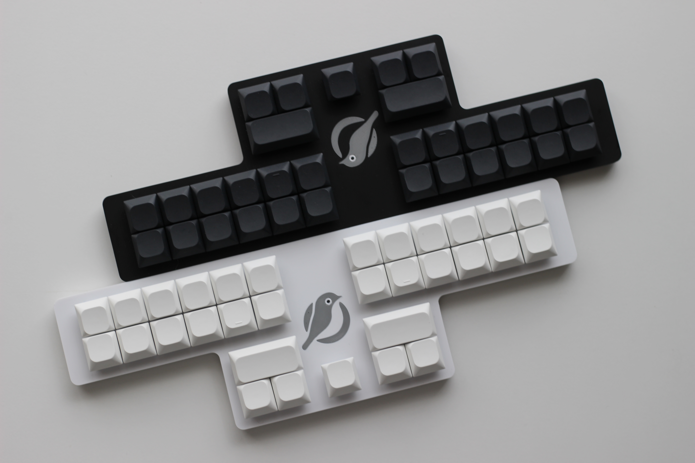

# Mejiro31


## 組み立て、初期設定 / Setup Manual
- [Mejiro31 の組み立て方](/docs/BUILD.md)

## 使用方法 / How to Use
- [Mejiro31 の使い方](/docs/USAGE.md)

## ビルド環境の構築 / How to Build Firmware
ファームウェアのソースコード / Firmware Sourcecode
- https://github.com/JEEBIS27/qmk_firmware/tree/master/keyboards/jeebis/mejiro31

ファームウェアをクローンする / Cloning the Repo for Firmware Build
```
git clone https://github.com/JEEBIS27/qmk_firmware.git
```

***

